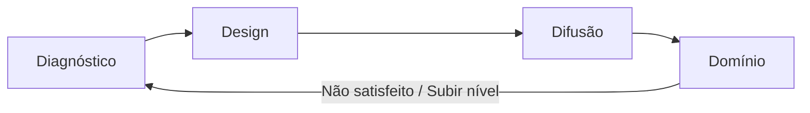
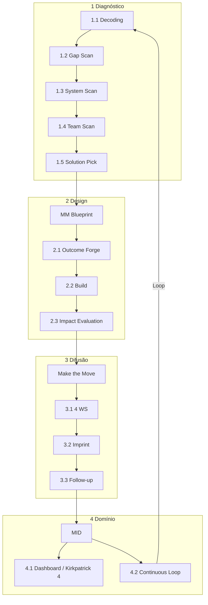

# Fluxo Miro — MM People Sprint 90+ (Magnus Waves™)

Board: [Miro — Manifesto MVP](https://miro.com/welcomeonboard/OHFhOTB0LzkrTHNSUE41STIranBkRVdkUzQwS0l3RFZqT0NuV1BnNnozTVZ5aEFaOHZRL1p1WEV3bStqbzRrU08vVCtLNnRKc0VVRDRUVGgwS0huZVFXOXo0SWtaMngyOHhITERvZC9TbmMwN2JiQUlsa0g5RlphVnVHQnFxTlB3VHhHVHd5UWtSM1BidUtUYmxycDRnPT0hdjE=?share_link_id=192123947908)

> Manifesto: `docs/MANIFESTO-MVP.md` · Constantes no código: `src/constants/magnusWaves.ts`

---

## Ciclo contínuo (logo People Sprint)

*Diagnóstico revela · Design estrutura · Difusão move · Domínio sustenta.*

---

## Onda 1 — Diagnóstico · Human-to-Business Canvas™

**Meta Miro:** terminar com o **canvas desenhado** (5 etapas).

| Etapa | Nome | MVP (tela / campo) |
|-------|------|---------------------|
| 1.1 | Decoding | `organizacao`, `produtoServico` |
| 1.2 | Gap Scan | `estagioNegocio` |
| 1.3 | System Scan | `fatoresExternos` |
| 1.4 | Team Scan | parte de `mudancasRecentes` |
| 1.5 | Solution Pick | `mudancasRecentes` |

**Rota:** `/dashboard/initial-form` · Firestore `initialForms`

---

## Onda 2 — Design · MM Blueprint

Entrada: resultado do canvas (diagnóstico completo).

| Etapa | Nome | MVP |
|-------|------|-----|
| 2 | MM Blueprint | People Sprint IA (`/dashboard/consultoria-ia`) |
| 2.1 | Outcome Forge | Chat — definir outcomes |
| 2.2 | Build | Chat — plano e prioridades |
| 2.3 | Impact Evaluation | Chat — avaliar impacto |
| — | Caminho B | *Fora do escopo MVP atual* |

**Gate:** banner se diagnóstico incompleto.

---

## Onda 3 — Difusão · Make the Move

Entrada: **MM Blueprint — final result** (saída do Design).

| Etapa | Nome | MVP |
|-------|------|-----|
| 3 | Make the Move | Início da execução |
| 3.1 | 4 WS | Objetivos + ritmo (workshops implícitos) |
| 3.2 | Imprint | Objetivos em andamento |
| 3.3 | Follow-up | Prazos, responsáveis, histórico |

**Rotas:** `/dashboard/objetivos`, `/dashboard/minha-equipe`, `/dashboard/historico`

---

## Onda 4 — Domínio · Magnus Intelligence Dashboard (MID)

Entrada: saída da Difusão (follow-up concluído / em curso).

| Etapa | Nome | MVP |
|-------|------|-----|
| 4 | MID | Hub + relatórios |
| 4.1 | Dashboard | Relatórios + stats (Kirkpatrick 4) |
| 4.2 | Continuous Loop | Histórico + mensagem “retomar passo 1” |

**Rota:** `/dashboard/relatorios` · Hub: `/dashboard`

**Loop Miro:**
- *Não satisfeito?* → retomar passo 1 (Diagnóstico)
- *Subir de nível?* → retomar passo 1

---

## Mapa completo (Miro → código)

---

## UI implementada

| Componente | Arquivo |
|------------|---------|
| Progresso 4 ondas | `MagnusWavesProgress.tsx` |
| Menu numerado | `DashboardLayout.tsx` |
| Canvas 5 passos | `InitialFormPage.tsx` |
| Estilos ondas | `magnus-waves.css` |

---

## Fora do MVP (Miro / site)

- Caminho B (Design)
- Biblioteca de boas práticas
- Trilhas / cursos
- WhatsApp
- Visualização gráfica do canvas (apenas formulário textual)

*Atualizado com boards Miro — maio/2026.*
