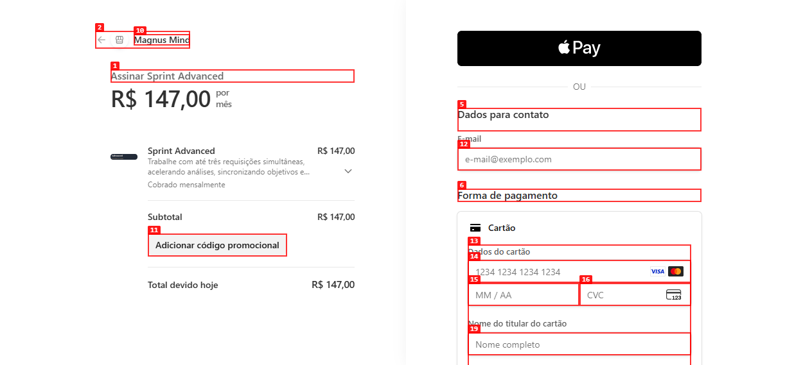
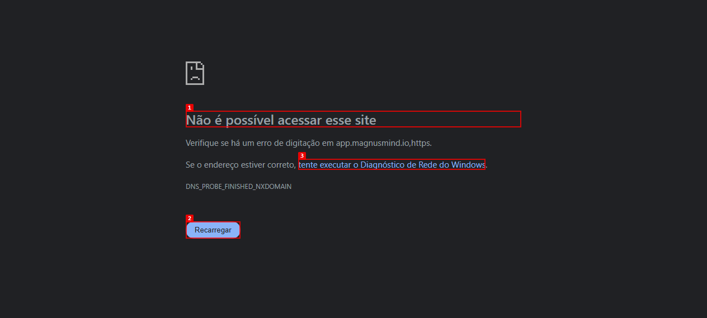

# Dogfood Report: Sprint / Magnus Mind

| Field | Value |
|-------|-------|
| **Date** | 2026-07-28 |
| **App URL** | https://app.magnusmind.io |
| **Session** | checkout-prod |
| **Scope** | Fluxo público de compra: landing → Stripe Checkout → retorno/cadastro |

## Summary

| Severity | Count |
|----------|-------|
| Critical | 1 |
| High | 2 |
| Medium | 0 |
| Low | 0 |
| **Total** | **3** |

## Issues

### ISSUE-001: URLs de retorno do Stripe são inválidas

| Field | Value |
|-------|-------|
| **Severity** | critical |
| **Category** | functional |
| **URL** | https://checkout.stripe.com |
| **Repro Video** | N/A |

**Description**

O checkout do plano Advanced é criado corretamente, mas o link “Voltar para Magnus Mind” tenta abrir `https://app.magnusmind.io,https//sprint.magnusmind.io/planos?payment=cancelled`. O navegador não consegue resolver esse endereço. Como o cliente não consegue voltar ao site e a URL de sucesso é construída a partir da mesma base, o fluxo não deve ser liberado para vendas antes da correção e de um pagamento controlado de ponta a ponta.

**Repro Steps**

1. Abra a landing pública e localize o plano Advanced.
   

2. Clique em “Assinar agora” e confirme o Checkout Advanced de R$ 147,00 por mês.
   

3. Clique em “Voltar para Magnus Mind”.
   

4. **Observe:** o navegador tenta acessar a URL inválida `https://app.magnusmind.io,https//sprint.magnusmind.io/planos?payment=cancelled` e mostra “Não é possível acessar esse site”.

---

### ISSUE-002: Webhook de billing não está cadastrado na conta Stripe live

| Field | Value |
|-------|-------|
| **Severity** | high |
| **Category** | functional |
| **URL** | https://three95-flavio-fcha.onrender.com/api/billing/webhook |
| **Repro Video** | N/A |

**Description**

A consulta read-only à API Stripe live encontrou apenas o webhook `https://connect.magnusmind.io/api/public/stripe/verification-webhook`, limitado ao evento `checkout.session.completed`. Não existe endpoint cadastrado para `/api/billing/webhook`. Assim, cancelamentos, atualizações da assinatura e falhas de cobrança não chegam ao Sprint.

**Repro Steps**

1. Consulte os webhooks da conta correspondente à `STRIPE_SECRET_KEY` live.
2. **Observe:** o endpoint de billing do Render não aparece na lista.
3. Cadastre `https://three95-flavio-fcha.onrender.com/api/billing/webhook` e habilite `checkout.session.completed`, `customer.subscription.updated`, `invoice.payment_failed` e `customer.subscription.deleted`.

---

### ISSUE-003: Conta Stripe live não possui conta bancária cadastrada

| Field | Value |
|-------|-------|
| **Severity** | high |
| **Category** | functional |
| **URL** | Stripe Dashboard |
| **Repro Video** | N/A |

**Description**

O health check live confirmou `charges_enabled` e `payouts_enabled`, mas retornou zero contas bancárias externas. A compra pode ser cobrada, porém não há destino bancário confirmado para os repasses. Isso deve ser resolvido antes de iniciar vendas ao cliente final.

**Repro Steps**

1. Execute `npm run stripe:health` em `server/` com as credenciais live.
2. **Observe:** `Conta bancária cadastrada (0)`.
3. Cadastre e valide a conta bancária no Stripe Dashboard e repita o health check.

---
